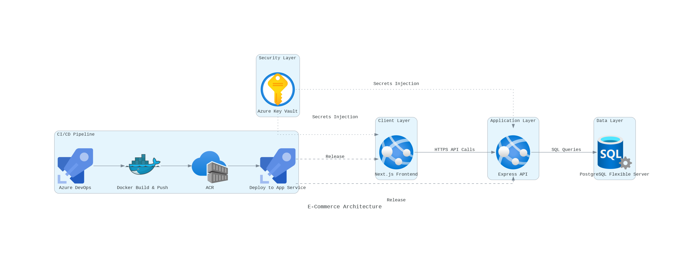
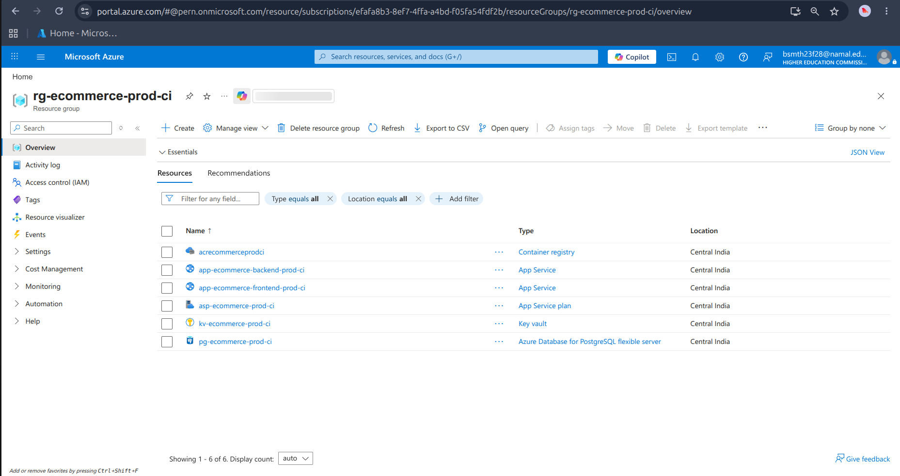
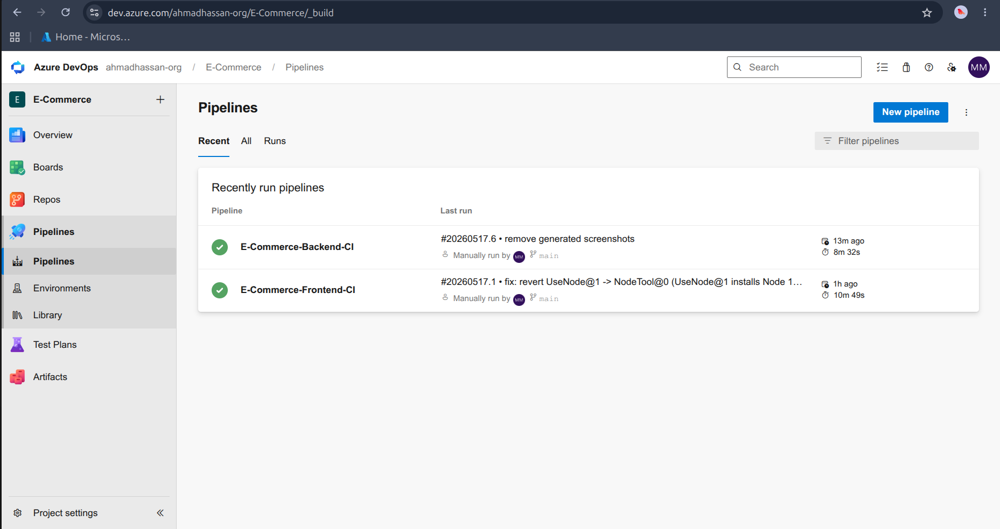
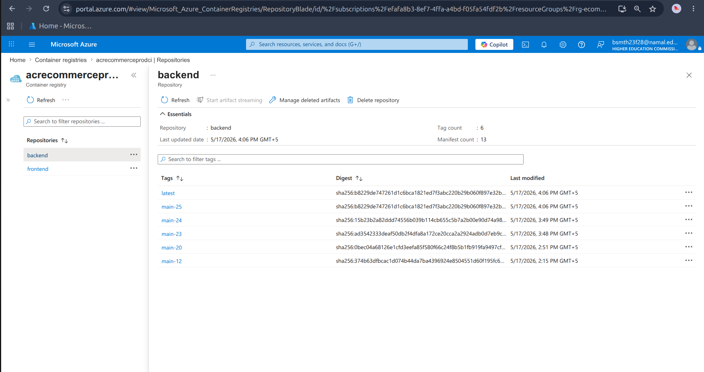
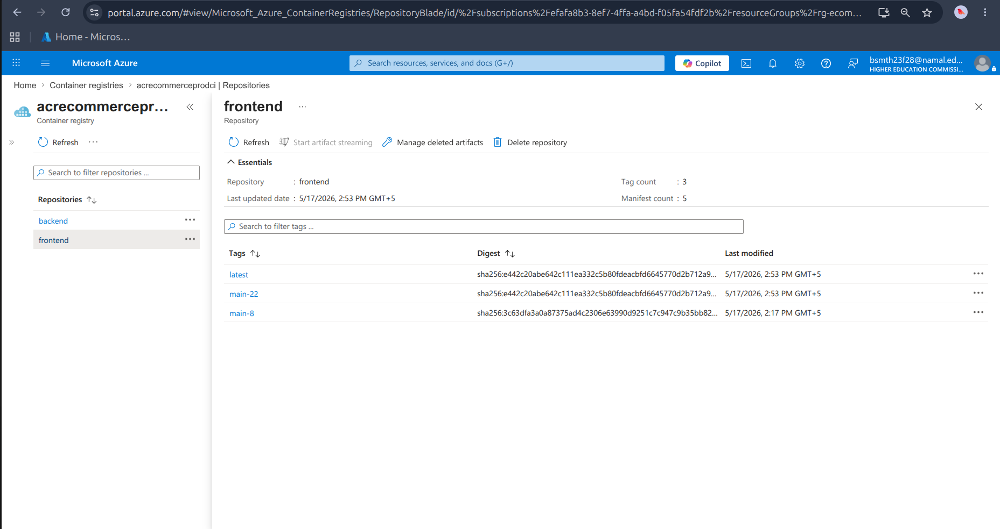
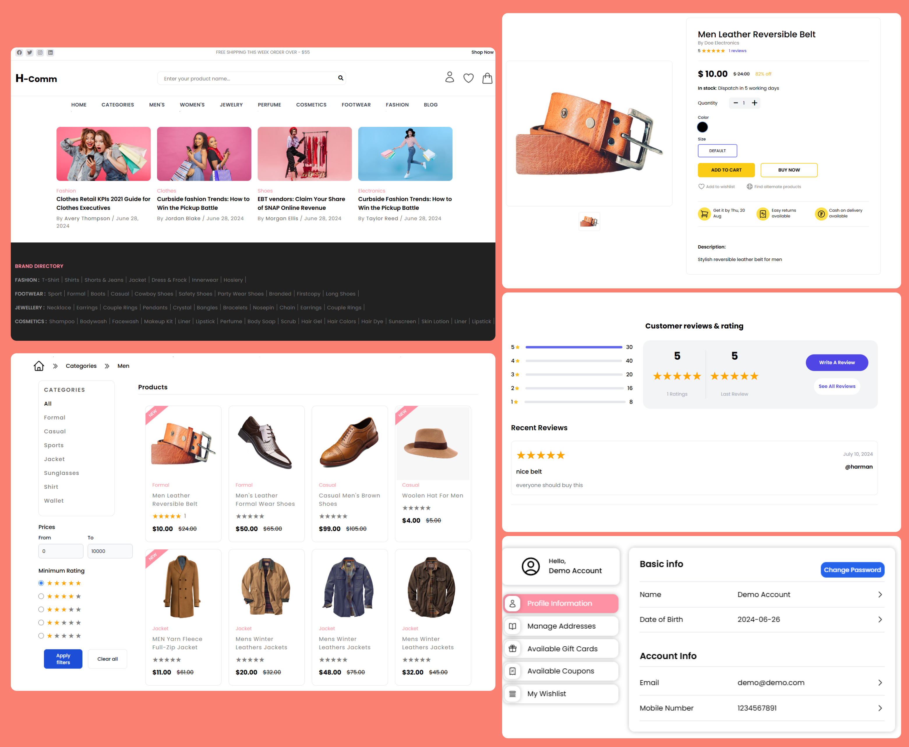
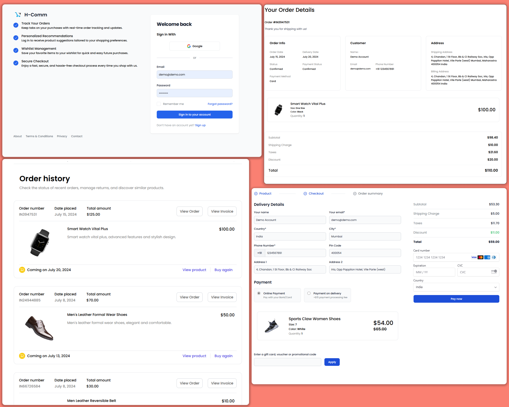
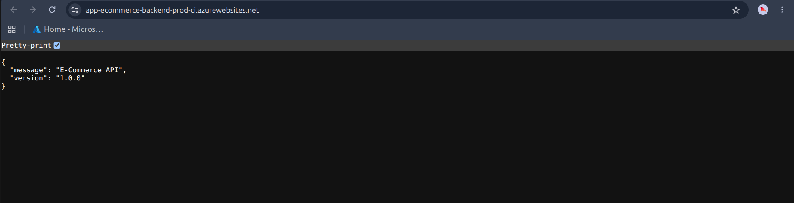

# E-Commerce Platform (PERN Stack)

A full-stack eCommerce solution built with the PERN stack (PostgreSQL, Express, React, Node.js). This project is containerized with Docker and features a robust CI/CD pipeline targeting Microsoft Azure.

---

## Live Environments

| Component | URL |
|-----------|-----|
| Frontend | [https://app-ecommerce-frontend-prod-ci.azurewebsites.net](https://app-ecommerce-frontend-prod-ci.azurewebsites.net) |
| Backend API | [https://app-ecommerce-backend-prod-ci.azurewebsites.net](https://app-ecommerce-backend-prod-ci.azurewebsites.net) |
| Container Registry | `acrecommerceprodci.azurecr.io` |

---

## Table of Contents
- [Key Features](#key-features)
- [Tech Stack](#tech-stack)
- [Lab Adaptation Highlights](#lab-adaptation-highlights)
- [Local Development](#local-development)
- [Docker Workflow](#docker-workflow)
- [Azure Deployment & CI/CD](#azure-deployment--cicd)
- [Environment Variables](#environment-variables)
- [Screenshots](#screenshots)

---

## Key Features

- **Organized Catalog** — Categories and subcategories for seamless navigation.
- **Product Customization** — Support for sizes, colors, and detailed product views.
- **Secure Payments** — Integrated with Stripe for reliable transactions.
- **Advanced Authentication** — JWT-based sessions and Google OAuth integration.
- **Order Management** — Full lifecycle tracking from cart to confirmation.
- **Interactive Reviews** — Robust product rating and review system.
- **Responsive UI** — Mobile-first design for a consistent experience across devices.
- **Performance Optimization** — Optimized with Next.js 14 and multi-stage Docker builds.

---

## Tech Stack

| Layer | Technologies |
|-------|--------------|
| Frontend | Next.js 14, React, TypeScript, Tailwind CSS |
| Backend | Node.js, Express, TypeScript |
| Database | PostgreSQL (Azure Flexible Server) |
| Authentication | JWT, Google OAuth 2.0 |
| Payments | Stripe API |
| Infrastructure | Docker, Azure App Service |
| CI/CD | Azure DevOps (YAML Pipelines) |

---

## Lab Adaptation Highlights

This project was adapted from a standard DevOps Lab requirement. Key adaptations include:

- **Database Migration:** Switched from Azure SQL to PostgreSQL Flexible Server to maintain native application compatibility without code changes.
- **Port Standardization:** Aligned backend ports to 3500 and frontend to 3000 (Next.js default).
- **Naming Conventions:** Adopted the `<abbr>-ecommerce-<env>` pattern for all Azure resources.
- **Next.js Integration:** Adapted standard React build steps for Next.js standalone output mode in Docker.

---

## Local Development

### Prerequisites
- Node.js 21+
- PostgreSQL 16+
- Docker and Docker Compose (Optional but recommended)

### Setup
1. **Clone the repository:**
   ```bash
   git clone https://github.com/Ahmadhassan011/E-Commerce.git
   cd E-Commerce
   ```
2. **Environment Setup:** Create a `.env` file in the root based on the [Environment Variables](#environment-variables) section.
3. **Start with Docker Compose:**
   ```bash
   docker compose up --watch
   ```
4. **Initialize Database:**
   ```bash
   docker compose exec db pg_restore -U postgres -d ecommerce /docker-entrypoint-initdb.d/ecommerce.sql
   ```

---

## Docker Workflow

The project utilizes multi-stage Alpine-based Dockerfiles to ensure minimal image size and maximum security.

- **Client:** Uses Next.js standalone output (Server-side rendering enabled).
- **Server:** Compiled TypeScript source to optimized JavaScript.

```bash
# Manual Build
./scripts/build.sh
```

---

## Azure Deployment & CI/CD

### Infrastructure Architecture


### CI/CD Pipelines
Two primary YAML pipelines are configured in Azure DevOps:
1. **Backend CI:** Build → Scan → Push to ACR → Deploy to App Service.
2. **Frontend CI:** Build → Smoke Test → Push to ACR → Deploy to App Service.

---

## Environment Variables

Detailed environment configuration for both Client and Server can be found in the [Deployment Docs](docs/deployment.md) or the tables below.

### Client
| Variable | Purpose |
|----------|---------|
| `BACKEND_URL` | API endpoint for the backend |
| `STRIPE_PUBLISHABLE_KEY` | Stripe public key for frontend |

### Server
| Variable | Purpose |
|----------|---------|
| `DB_HOST` / `DB_USER` / `DB_PASS` | Database credentials |
| `JWT_KEY` | Secret for token signing |

---

## Screenshots

### Azure Resource Group


### Pipeline Execution


### Azure Container Registry
<p align="center">
  
  
</p>

### Application Demo


<p align="center">
  
  
</p>

<p align="center">
  
</p>

---

## License
Distributed under the MIT License. See `LICENSE` for more information.
